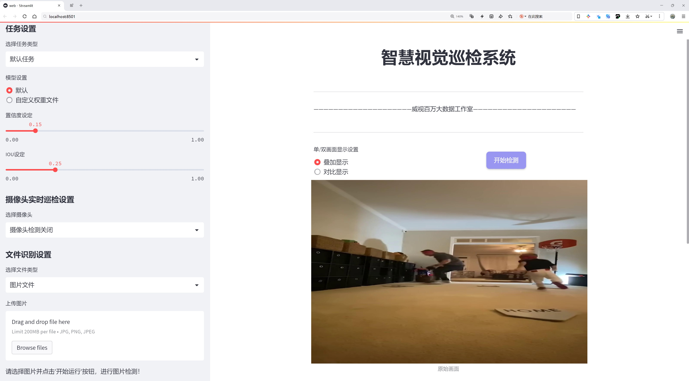
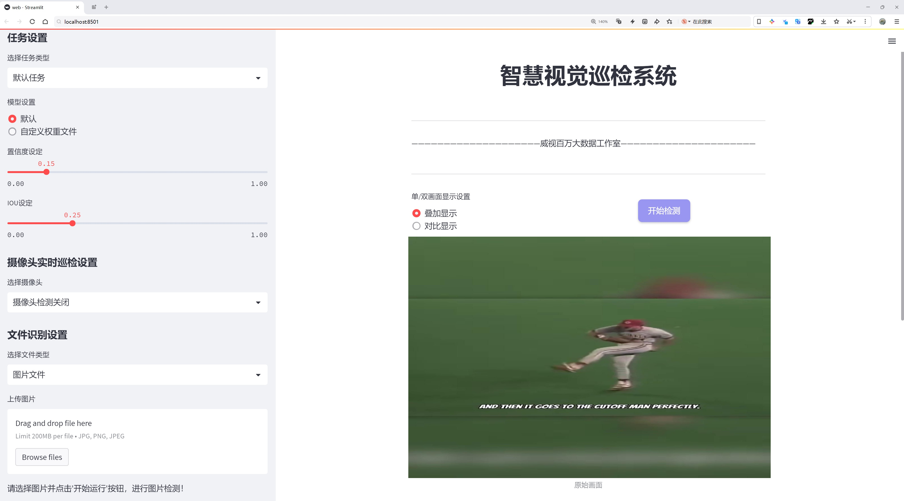
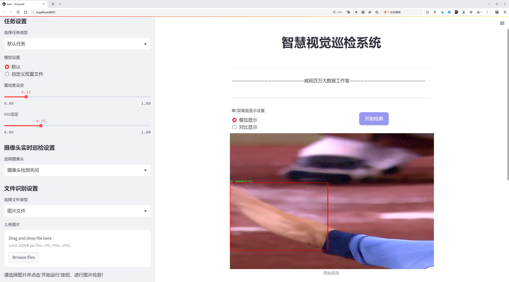
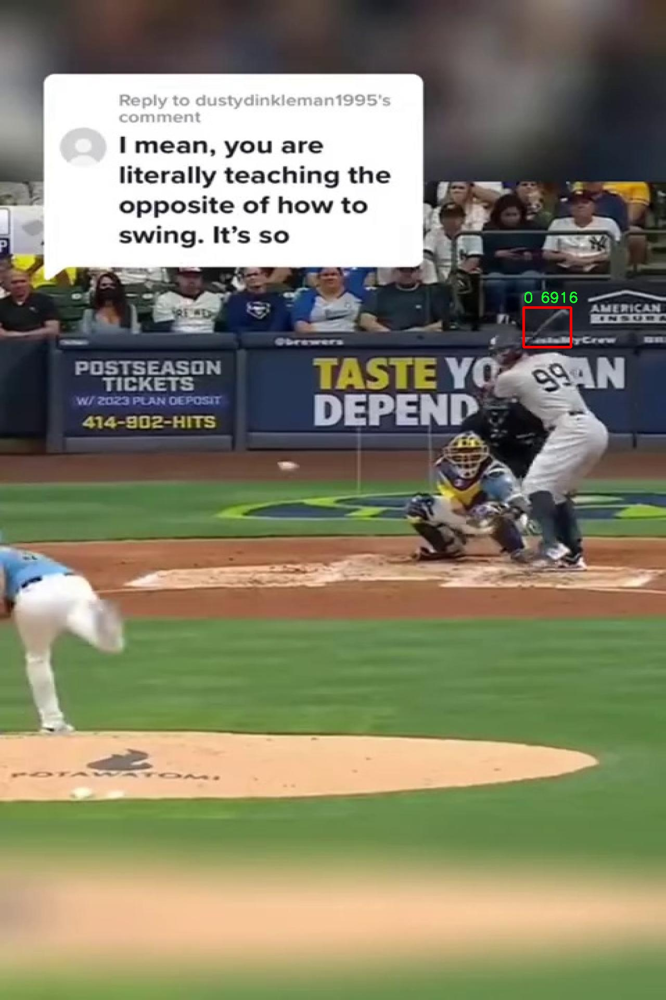

# 棒球运动物体检测系统源码分享
 # [一条龙教学YOLOV8标注好的数据集一键训练_70+全套改进创新点发刊_Web前端展示]

### 1.研究背景与意义

项目参考[AAAI Association for the Advancement of Artificial Intelligence](https://gitee.com/qunmasj/projects)

项目来源[AACV Association for the Advancement of Computer Vision](https://kdocs.cn/l/cszuIiCKVNis)

研究背景与意义

随着计算机视觉技术的迅猛发展，物体检测在多个领域的应用愈加广泛，尤其是在体育领域中，运动物体的实时检测与分析已成为提升比赛观赏性和训练效率的重要手段。棒球作为一项全球广受欢迎的运动，其比赛过程中涉及到的多种物体，如棒球、棒球棒等，均需要精准的检测与识别，以便于裁判、教练及观众更好地理解比赛动态。传统的物体检测方法往往面临着识别精度不足、实时性差等问题，而近年来深度学习技术的兴起为这一领域带来了新的机遇。

YOLO（You Only Look Once）系列模型因其高效的检测速度和良好的准确率而备受关注。YOLOv8作为该系列的最新版本，进一步优化了网络结构和算法性能，使其在复杂场景下的物体检测能力显著提升。然而，针对特定领域的应用，尤其是棒球运动中的物体检测，现有的YOLOv8模型仍存在一定的局限性。为了提高模型在棒球运动中对不同物体的检测精度，尤其是在复杂背景和快速运动的情况下，改进YOLOv8模型显得尤为重要。

本研究旨在基于改进的YOLOv8模型，构建一个高效的棒球运动物体检测系统。我们将利用一个包含9900张图像的棒球数据集，该数据集涵盖了五个类别的物体，包括棒球、棒球棒等，具备丰富的样本量和多样的场景设置。这一数据集的构建为模型的训练和验证提供了坚实的基础，能够有效提升模型的泛化能力和检测精度。

通过对YOLOv8模型的改进，我们将重点关注以下几个方面：首先，优化特征提取网络，以增强模型对小物体和快速运动物体的检测能力；其次，改进损失函数，使其更适应棒球运动中物体的特征；最后，采用数据增强技术，提升模型在不同环境下的鲁棒性。通过这些改进，我们期望能够实现对棒球运动中关键物体的高效、准确检测，从而为教练和运动员提供有价值的数据支持，促进训练和比赛策略的优化。

本研究的意义不仅在于提升棒球运动物体检测的技术水平，更在于推动计算机视觉技术在体育领域的应用发展。通过构建一个高效的棒球运动物体检测系统，我们将为后续的研究提供新的思路和方法，同时也为相关领域的应用，如智能裁判、比赛分析和观众体验提升等，奠定基础。综上所述，本研究在理论和实践层面均具有重要的学术价值和应用前景。

### 2.图片演示







##### 注意：由于此博客编辑较早，上面“2.图片演示”和“3.视频演示”展示的系统图片或者视频可能为老版本，新版本在老版本的基础上升级如下：（实际效果以升级的新版本为准）

  （1）适配了YOLOV8的“目标检测”模型和“实例分割”模型，通过加载相应的权重（.pt）文件即可自适应加载模型。

  （2）支持“图片识别”、“视频识别”、“摄像头实时识别”三种识别模式。

  （3）支持“图片识别”、“视频识别”、“摄像头实时识别”三种识别结果保存导出，解决手动导出（容易卡顿出现爆内存）存在的问题，识别完自动保存结果并导出到tempDir中。

  （4）支持Web前端系统中的标题、背景图等自定义修改，后面提供修改教程。

  另外本项目提供训练的数据集和训练教程,暂不提供权重文件（best.pt）,需要您按照教程进行训练后实现图片演示和Web前端界面演示的效果。

### 3.视频演示

[3.1 视频演示](https://www.bilibili.com/video/BV1se1kYSEDJ/)

### 4.数据集信息展示

##### 4.1 本项目数据集详细数据（类别数＆类别名）

nc: 2
names: ['0', '2']


##### 4.2 本项目数据集信息介绍

数据集信息展示

在本研究中，我们采用了名为“Baseball batch 1”的数据集，以改进YOLOv8的棒球运动物体检测系统。该数据集专门为棒球运动相关的物体检测任务而设计，旨在提升模型在复杂场景下的识别精度和鲁棒性。数据集的构建过程经过精心策划，确保涵盖了多样化的场景和物体，以便于训练出一个能够在实际应用中表现优异的检测系统。

“Baseball batch 1”数据集包含两个主要类别，分别标记为“0”和“2”。这些类别的选择反映了棒球运动中关键的物体类型，其中“0”可能代表棒球本身，而“2”则可能对应于球员或其他相关的运动装备。这样的分类设计使得模型能够在训练过程中学习到不同物体的特征和上下文信息，从而在实际应用中更准确地进行识别和定位。

数据集的构成不仅仅依赖于数量的丰富性，更注重于数据的多样性和复杂性。为确保模型能够适应不同的环境和条件，数据集中包含了多种拍摄角度、光照条件和背景场景。这种多样性使得模型在面对现实世界中复杂的棒球比赛场景时，能够保持较高的检测准确率。此外，数据集中的每个图像都经过精细的标注，确保了训练过程中使用的每个样本都具备高质量的标签信息。这一过程不仅提高了数据集的可靠性，也为后续的模型评估提供了坚实的基础。

在训练过程中，YOLOv8模型将利用“Baseball batch 1”数据集进行反复的学习和优化。通过对不同类别物体的特征进行提取和分析，模型将逐步提高其在棒球运动场景中的检测能力。值得注意的是，数据集的设计也考虑到了模型的泛化能力，确保其不仅能够在训练数据上表现良好，还能在未见过的场景中保持稳定的性能。这一目标的实现，将为棒球运动的自动化分析和智能化应用奠定基础。

随着研究的深入，我们将不断对“Baseball batch 1”数据集进行扩展和优化，以满足更高的检测需求和应用场景。未来的工作将包括引入更多的类别和样本，增加数据集的丰富性，从而进一步提升YOLOv8模型的性能。通过不断迭代和改进，我们期望能够在棒球运动物体检测领域取得突破，为相关的智能应用提供强有力的支持。

综上所述，“Baseball batch 1”数据集不仅是本研究的核心组成部分，更是推动YOLOv8模型改进的重要基础。通过精心设计和多样化的样本选择，该数据集为实现高效、准确的棒球运动物体检测系统提供了坚实的保障。随着研究的深入和数据集的不断完善，我们有信心在这一领域取得更大的进展。




### 5.全套项目环境部署视频教程（零基础手把手教学）

[5.1 环境部署教程链接（零基础手把手教学）](https://www.ixigua.com/7404473917358506534?logTag=c807d0cbc21c0ef59de5)


[5.2 安装Python虚拟环境创建和依赖库安装视频教程链接（零基础手把手教学）](https://www.ixigua.com/7404474678003106304?logTag=1f1041108cd1f708b01a)

### 6.手把手YOLOV8训练视频教程（零基础小白有手就能学会）

[6.1 手把手YOLOV8训练视频教程（零基础小白有手就能学会）](https://www.ixigua.com/7404477157818401292?logTag=d31a2dfd1983c9668658)


按照上面的训练视频教程链接加载项目提供的数据集，运行train.py即可开始训练



     Epoch   gpu_mem       box       obj       cls    labels  img_size
     1/200     20.8G   0.01576   0.01955  0.007536        22      1280: 100%|██████████| 849/849 [14:42<00:00,  1.04s/it]
               Class     Images     Labels          P          R     mAP@.5 mAP@.5:.95: 100%|██████████| 213/213 [01:14<00:00,  2.87it/s]
                 all       3395      17314      0.994      0.957      0.0957      0.0843

     Epoch   gpu_mem       box       obj       cls    labels  img_size
     2/200     20.8G   0.01578   0.01923  0.007006        22      1280: 100%|██████████| 849/849 [14:44<00:00,  1.04s/it]
               Class     Images     Labels          P          R     mAP@.5 mAP@.5:.95: 100%|██████████| 213/213 [01:12<00:00,  2.95it/s]
                 all       3395      17314      0.996      0.956      0.0957      0.0845

     Epoch   gpu_mem       box       obj       cls    labels  img_size
     3/200     20.8G   0.01561    0.0191  0.006895        27      1280: 100%|██████████| 849/849 [10:56<00:00,  1.29it/s]
               Class     Images     Labels          P          R     mAP@.5 mAP@.5:.95: 100%|███████   | 187/213 [00:52<00:00,  4.04it/s]
                 all       3395      17314      0.996      0.957      0.0957      0.0845


### 7.70+种全套YOLOV8创新点代码加载调参视频教程（一键加载写好的改进模型的配置文件）

[7.1 70+种全套YOLOV8创新点代码加载调参视频教程（一键加载写好的改进模型的配置文件）](https://www.ixigua.com/7404478314661806627?logTag=29066f8288e3f4eea3a4)

### 8.70+种全套YOLOV8创新点原理讲解（非科班也可以轻松写刊发刊，V10版本正在科研待更新）

#### 由于篇幅限制，每个创新点的具体原理讲解就不一一展开，具体见下列网址中的创新点对应子项目的技术原理博客网址【Blog】：


[8.1 70+种全套YOLOV8创新点原理讲解链接](https://gitee.com/qunmasj/good)

#### 部分改进原理讲解(完整的改进原理见上图和技术博客链接)

### YOLOv8简介
#### YOLOv8是什么？
YOLOv8是Ultralytics公司推出的基于对象检测模型的YOLO最新系列，它能够提供截至目前最先进的对象检测性能。

借助于以前的YOLO模型版本支持技术，YOLOv8模型运行得更快、更准确，同时为执行任务的训练模型提供了统一的框架，这包括：

目标检测
实例分割
图像分类
在撰写本文时，Ultralytics的YOLOv8存储库中其实还有很多功能有待添加，这包括训练模型的整套导出功能等。此外，Ultralytics将计划在Arxiv上发布一篇相关的论文，将对YOLOv8与其他最先进的视觉模型进行比较。

#### YOLOv8的新功能
Ultralytics为YOLO模型发布了一个全新的存储库（https://github.com/ultralytics/ultralytics）。该存储库被构建为用于训练对象检测、实例分割和图像分类模型的统一框架。

以下列举的是这个新版本的一些关键功能：

用户友好的API（命令行+Python）。
更快、更准确。
支持：
目标检测，
实例分割和
图像分类。
可扩展到所有以前的版本。
新的骨干网络。
新的Anchor-Free head对象检测算法。
新的损失函数。
此外，YOLOv8也非常高效和灵活，它可以支持多种导出格式，而且该模型可以在CPU和GPU上运行。

#### YOLOv8中提供的子模型


YOLOv8模型的每个类别中共有五个模型，以便共同完成检测、分割和分类任务。其中，YOLOv8 Nano是最快和最小的模型，而YOLOv8Extra Large（YOLOv8x）是其中最准确但最慢的模型。

YOLOv8这次发行中共附带了以下预训练模型：

在图像分辨率为640的COCO检测数据集上训练的对象检测检查点。
在图像分辨率为640的COCO分割数据集上训练的实例分割检查点。
在图像分辨率为224的ImageNet数据集上预处理的图像分类模型。
### 高效网络架构 CloAtt简介
众所周知，自从 ViTs 提出后，Transformer 基本横扫各大 CV 主流任务，包括视觉识别、目标检测和语义分割等。然而，一个比较棘手的问题就是这个架构参数量和计算量太大，所以一直被广受诟病。因此，后续有不少工作都是朝着这个方向去改进，例如 Swin-Transformer 在局部非重叠窗口中进行注意力计算，而 PVT 中则是使用平均池化来合并 token 以进一步压缩耗时。然而，这些 ViTs 由于其参数量太大以及高 FLOPs 并不适合部署到移动设备。如果我们直接缩小到适合移动设备的尺寸时，它们的性能又会显著降低。


#### MobileViT
因此，出现了不少工作聚焦于探索轻量级的视觉变换器，使 ViTs 适用于移动设备，CVHub 此前也介绍过不少的工作，大家有兴趣可以翻阅历史文章读读。例如，苹果团队提出的 MobileViT 研究了如何将 CNN 与 Transformer 相结合，而另一个工作 MobileFormer 则将轻量级的 MobileNet 与 Transformer 进行融合。此外，最新提出的 EdgeViT 提出了一个局部-全局-局部模块来聚合信息。以上工作的目标都是设计具有高性能、较少参数和低 FLOPs 的移动端友好型模型。


#### EdgeViT
然而，作者从频域编码的角度认为，在现有的轻量级模型中，大多数方法只关注设计稀疏注意力，以有效地处理低频全局信息，而使用相对简单的方法处理高频局部信息。具体而言，大多数模型如 EdgeViT 和 MobileViT，只是简单使用原始卷积提取局部表示，这些方法仅使用卷积中的全局共享权重处理高频本地信息。其他方法，如 LVT ，则是首先将标记展开到窗口中，然后使用窗口内的注意力获得高频信息。这些方法仅使用特定于每个 Token 的上下文感知权重进行局部感知。


#### LVT
虽然上述轻量级模型在多个数据集上取得了良好的结果，但没有一种方法尝试设计更有效的方法，即利用共享和上下文感知权重的优势来处理高频局部信息。基于共享权重的方法，如传统的卷积神经网络，具有平移等变性的特征。与它们不同，基于上下文感知权重的方法，如 LVT 和 NAT，具有可以随输入内容变化的权重。这两种类型的权重在局部感知中都有自己的优势。
#### NAT


受该博客的启发，本文设计了一种轻量级视觉变换器——CloAtt，其利用了上下文感知的局部增强。特别地，CloAtt 采用了双分支设计结构。
#### 局部分支
在局部分支中，本文引入了一个精心设计的 AttnConv，一种简单而有效的卷积操作符，它采用了注意力机制的风格。所提出的 AttnConv 有效地融合了共享权重和上下文感知权重，以聚合高频的局部信息。具体地，AttnConv 首先使用深度卷积（DWconv）提取局部表示，其中 DWconv 具有共享权重。然后，其使用上下文感知权重来增强局部特征。与 Non-Local 等生成上下文感知权重的方法不同，AttnConv 使用门控机制生成上下文感知权重，引入了比常用的注意力机制更强的非线性。此外，AttnConv 将卷积算子应用于 Query 和 Key 以聚合局部信息，然后计算 Q 和 K 的哈达玛积，并对结果进行一系列线性或非线性变换，生成范围在 [-1,1] 之间的上下文感知权重。值得注意的是，AttnConv 继承了卷积的平移等变性，因为它的所有操作都基于卷积。
#### 全局分支
在全局分支中则使用了传统的注意力机制，但对 K 和 V 进行了下采样以减少计算量，从而捕捉低频全局信息。最后，CloFormer 通过简单的方法将局部分支和全局分支的输出进行融合，从而使模型能够同时捕捉高频和低频信息。总的来说，CloFormer 的设计能够同时发挥共享权重和上下文感知权重的优势，提高其局部感知的能力，使其在图像分类、物体检测和语义分割等多个视觉任务上均取得了优异的性能。
如上图2所示，CloFormer 共包含一个卷积主干和四个 stage，每个 stage you Clo 模块 和 ConvFFN 组合而成的模块堆叠而成 。具体得，首先将输入图像通过卷积主干传递，以获取 token 表示。该主干由四个卷积组成，每个卷积的步长依次为2、2、1和1。接下来，tokens 经历四个 Clo 块和 ConvFFN 阶段，以提取分层特征。最后，再利用全局平均池化和全连接层生成预测结果。可以看出，整个架构非常简洁，支持即插即用！


#### ConvFFN
为了将局部信息融入 FFN 过程中，本文采用 ConvFFN 替换了常用的 FFN。ConvFFN 和常用的 FFN 的主要区别在于，ConvFFN 在 GELU 激活函数之后使用了深度卷积（DWconv），从而使 ConvFFN 能够聚合局部信息。由于DWconv 的存在，可以直接在 ConvFFN 中进行下采样而不需要引入 PatchMerge 模块。CloFormer 使用了两种ConvFFN。第一种是在阶段内的 ConvFFN，它直接利用跳跃连接。另一种是连接两个阶段的 ConvFFN，主要用于下采样操作。
#### Clo block
CloFormer 中的 Clo块 是非常关键的组件。每个 Clo 块由一个局部分支和一个全局分支组成。在全局分支中，我们首先下采样 K 和 V，然后对 Q、K 和 V 进行标准的 attention 操作，以提取低频全局信息。
虽然全局分支的设计能够有效减少注意力机制所需的浮点运算次数，并且能够获得全局的感受野。然而，它在处理高频局部信息方面的能力不足。为了解决这个问题，CloFormer 引入了局部分支，并使用 AttnConv 对高频局部信息进行处理。AttnConv 可以融合共享权重和上下文感知权重，能够更好地处理高频局部信息。因此，CloFormer 结合了全局和局部的优势来提高图像分类性能。下面我们重点讲下 AttnConv 。
#### AttnConv
AttnConv 是一个关键模块，使得所提模型能够获得高性能。它结合了一些标准的 attention 操作。具体而言，在AttnConv 中，我们首先进行线性变换以获得 Q、K和V。在进行线性变换之后，我们再对 V 进行共享权重的局部特征聚合。然后，基于处理后的 V 和 Q ，K 进行上下文感知的局部增强。具体流程可对照流程图理解，我们可以将其拆解成三个步骤。
#### Local Feature Aggregation
为了简单起见，本文直接使用一个简单的深度卷积（DWconv）来对 V 进行局部信息聚合。
#### Context-aware Local Enhancement
在将具有共享权重的局部信息整合到 V 中后，我们结合 Q 和 K 生成上下文感知权重。值得注意的是，我们使用了与局部自注意力不同的方法，该方法更加简洁。具体而言，我们首先使用两个 DWconv 对 Q 和 K 分别进行局部信息聚合。然后，我们计算 Q 和 K 的 Hadamard 乘积，并对结果进行一系列转换，以获取在 -1 到 1 之间的上下文感知权重。最后，我们使用生成的权重来增强局部特征。
#### Fusion with Global Branch
在整个 CloFormer 中，我们使用一种简单直接的方法来将局部分支和全局分支的输出进行融合。具体而言，本文是通过将这两个输出在通道维度上进行直接拼接，然后再通过一个 FC 层聚合这些特征并结合残差输出。
最后，上图展示了三种不同的方法。相比于传统卷积，AttnConv 中的上下文感知权重使得模型能够更好地适应输入内容。相比于局部自注意力机制，引入共享权重使得模型能够更好地处理高频信息，从而提高性能。此外，生成上下文感知权重的方法引入了更强的非线性性，也提高了性能。需要注意的是，AttnConv 中的所有操作都基于卷积，保持了卷积的平移等变性特性。


### 9.系统功能展示（检测对象为举例，实际内容以本项目数据集为准）

图9.1.系统支持检测结果表格显示

  图9.2.系统支持置信度和IOU阈值手动调节

  图9.3.系统支持自定义加载权重文件best.pt(需要你通过步骤5中训练获得)

  图9.4.系统支持摄像头实时识别

  图9.5.系统支持图片识别

  图9.6.系统支持视频识别

  图9.7.系统支持识别结果文件自动保存

  图9.8.系统支持Excel导出检测结果数据


### 10.原始YOLOV8算法原理

原始YOLOv8算法原理

YOLOv8算法是由Ultralytics团队在YOLOv5的基础上进行改进和创新的产物，旨在提升目标检测的精度和速度。该算法于2023年1月正式发布，标志着YOLO系列模型的又一次重要进化。YOLOv8不仅继承了前几代模型的核心思想，还吸收了近两年内的多项技术进步，力求在实际应用中实现更好的性能。

YOLOv8的网络结构分为三个主要部分：Backbone、Neck和Head。Backbone部分负责特征提取，采用了一系列卷积和反卷积层，利用残差连接和瓶颈结构来减小网络的大小并提高性能。在这一部分，YOLOv8引入了C2f模块，取代了YOLOv5中的C3模块。C2f模块通过增加更多的跳层连接，增强了梯度流的丰富性，从而提高了模型的学习能力。这种设计不仅保留了SPPF（快速空间金字塔池化）模块的优势，还在执行时间上进行了优化，确保了模型的高效性。

在Neck部分，YOLOv8继续采用FPN（特征金字塔网络）和PAN（路径聚合网络）结构，以实现多尺度特征的融合。这一设计使得网络能够更好地捕捉不同尺度目标的信息，从而提升目标检测的性能和鲁棒性。Neck部分的所有C3模块也被替换为C2f模块，进一步提升了特征融合的效果。

YOLOv8的Head部分则是其最具创新性的地方。与之前的YOLO系列模型不同，YOLOv8采用了解耦头的结构，分别为分类和定位任务设计了两条并行的分支。这种设计的优势在于，分类任务更关注特征图中提取到的特征与已有类别的相似性，而定位任务则更加关注边界框与真实框之间的关系。通过这种解耦，YOLOv8在收敛速度和预测精度上都有了显著提升。

在数据预处理方面，YOLOv8延续了YOLOv5的策略，采用了多种数据增强手段，包括马赛克增强、混合增强、空间扰动和颜色扰动。然而，YOLOv8在训练的最后10个epoch中停止使用马赛克增强，以避免对数据真实分布的破坏。这一策略的调整旨在提高模型的鲁棒性和泛化能力，使其在面对真实场景时表现更加出色。

标签分配策略也是YOLOv8的一大亮点。不同于YOLOv5依赖于数据集的自动聚类候选框，YOLOv8采用了TOOD（动态标签分配）策略，旨在优化正负样本的匹配。这一策略通过动态调整标签分配，使得模型在训练过程中能够更有效地学习到目标的特征，提升了检测的准确性。YOLOv8的损失函数主要由类别损失和位置损失组成，其中类别损失采用了VFL（Varifocal Loss），而回归损失则结合了CIoU Loss和DFL Loss。VFL通过不对称参数对正负样本进行加权，确保模型在训练时更加关注高质量的正样本，从而提升整体的检测性能。

在实际应用中，YOLOv8模型在COCO数据集上的表现尤为突出，展现了其在目标检测任务中的强大能力。通过与其他YOLO系列模型的对比，YOLOv8在同样的模型尺寸下，能够在不显著增加参数量的情况下，取得更高的精度和更快的推理速度。这一特性使得YOLOv8在实时性和准确性兼顾的任务中，成为了一个理想的选择。

综上所述，YOLOv8算法通过一系列创新和改进，提升了目标检测的性能和效率。其在网络结构、数据处理、标签分配等多个方面的优化，使得YOLOv8不仅能够在理论上取得优异的成绩，更能够在实际应用中展现出强大的能力。这些特性使得YOLOv8在未来的研究和应用中，具有广泛的前景和价值。


### 11.项目核心源码讲解（再也不用担心看不懂代码逻辑）

#### 11.1 ui.py

以下是经过精简和注释的核心代码部分：

```python
import sys
import subprocess

def run_script(script_path):
    """
    使用当前 Python 环境运行指定的脚本。

    Args:
        script_path (str): 要运行的脚本路径
    """
    # 获取当前 Python 解释器的路径
    python_path = sys.executable

    # 构建运行命令，使用 streamlit 运行指定的脚本
    command = f'"{python_path}" -m streamlit run "{script_path}"'

    # 执行命令，并捕获结果
    result = subprocess.run(command, shell=True)
    
    # 检查脚本运行是否成功
    if result.returncode != 0:
        print("脚本运行出错。")

# 主程序入口
if __name__ == "__main__":
    # 指定要运行的脚本路径
    script_path = "web.py"  # 假设脚本在当前目录下

    # 调用函数运行脚本
    run_script(script_path)
```

### 代码注释说明：
1. **导入模块**：
   - `sys`：用于获取当前 Python 解释器的路径。
   - `subprocess`：用于执行外部命令。

2. **`run_script` 函数**：
   - 功能：运行指定路径的 Python 脚本。
   - 参数：`script_path`，要运行的脚本文件路径。
   - 获取当前 Python 解释器的路径，并构建一个命令来运行 `streamlit` 应用。
   - 使用 `subprocess.run` 执行命令，并检查返回码以确定脚本是否成功运行。

3. **主程序入口**：
   - 在脚本被直接运行时，指定要执行的脚本路径，并调用 `run_script` 函数来运行该脚本。

这个程序文件 `ui.py` 的主要功能是运行一个指定的 Python 脚本，具体来说是使用 Streamlit 框架来启动一个 Web 应用。代码中首先导入了必要的模块，包括 `sys`、`os` 和 `subprocess`，这些模块分别用于处理系统参数、文件路径和执行外部命令。

在文件的开头，定义了一个名为 `run_script` 的函数，该函数接受一个参数 `script_path`，表示要运行的脚本的路径。函数内部首先获取当前 Python 解释器的路径，这通过 `sys.executable` 实现。接着，构建一个命令字符串，该命令用于在命令行中运行 Streamlit 应用，具体的命令格式为 `python -m streamlit run script_path`。这里使用了 Python 的 `subprocess.run` 方法来执行这个命令，`shell=True` 表示在一个新的 shell 中执行命令。

在执行命令后，程序会检查返回的状态码，如果返回码不为 0，说明脚本运行过程中出现了错误，此时会打印出“脚本运行出错。”的提示信息。

最后，在文件的主程序部分，使用 `if __name__ == "__main__":` 语句来确保只有在直接运行该文件时才会执行以下代码。这里指定了要运行的脚本路径，调用了 `abs_path` 函数来获取 `web.py` 的绝对路径。然后，调用 `run_script` 函数来执行这个脚本。

总体来看，这个程序文件的作用是为用户提供一个简单的接口，以便于在当前 Python 环境中运行一个 Streamlit 应用。通过这种方式，用户可以方便地启动 Web 应用，而不需要手动输入命令。

#### 11.2 code\ultralytics\utils\benchmarks.py

以下是代码中最核心的部分，并附上详细的中文注释：

```python
import time
import numpy as np
import pandas as pd
from ultralytics import YOLO
from ultralytics.utils import select_device, check_requirements, check_yolo

def benchmark(
    model='yolov8n.pt', data=None, imgsz=160, half=False, int8=False, device="cpu", verbose=False
):
    """
    对YOLO模型进行基准测试，评估不同格式的速度和准确性。

    参数:
        model (str): 模型文件的路径，默认为'yolov8n.pt'。
        data (str): 用于评估的数据集，默认为None。
        imgsz (int): 基准测试使用的图像大小，默认为160。
        half (bool): 是否使用半精度模型，默认为False。
        int8 (bool): 是否使用int8精度模型，默认为False。
        device (str): 运行基准测试的设备，默认为'cpu'。
        verbose (bool): 如果为True，则在基准测试失败时抛出异常，默认为False。

    返回:
        df (pandas.DataFrame): 包含每种格式的基准测试结果的DataFrame，包括文件大小、指标和推理时间。
    """
    
    pd.options.display.max_columns = 10  # 设置pandas显示的最大列数
    pd.options.display.width = 120  # 设置pandas显示的宽度
    device = select_device(device, verbose=False)  # 选择设备
    model = YOLO(model)  # 加载YOLO模型

    results = []  # 存储结果的列表
    start_time = time.time()  # 记录开始时间

    # 遍历不同的导出格式
    for i, (name, format, suffix, cpu, gpu) in export_formats().iterrows():
        emoji, filename = "❌", None  # 默认导出状态为失败
        try:
            # 检查导出格式的兼容性
            if "cpu" in device.type:
                assert cpu, "CPU不支持此推理"
            if "cuda" in device.type:
                assert gpu, "GPU不支持此推理"

            # 导出模型
            if format == "-":
                filename = model.ckpt_path or model.cfg  # PyTorch格式
                exported_model = model
            else:
                filename = model.export(imgsz=imgsz, format=format, half=half, int8=int8, device=device, verbose=False)
                exported_model = YOLO(filename, task=model.task)
                assert suffix in str(filename), "导出失败"
            emoji = "✅"  # 导出成功

            # 进行推理
            exported_model.predict(ASSETS / "bus.jpg", imgsz=imgsz, device=device, half=half)

            # 验证模型
            data = data or TASK2DATA[model.task]  # 获取数据集
            key = TASK2METRIC[model.task]  # 获取评估指标
            results_dict = exported_model.val(
                data=data, batch=1, imgsz=imgsz, plots=False, device=device, half=half, int8=int8, verbose=False
            )
            metric, speed = results_dict.results_dict[key], results_dict.speed["inference"]
            results.append([name, "✅", round(file_size(filename), 1), round(metric, 4), round(speed, 2)])
        except Exception as e:
            LOGGER.warning(f"ERROR ❌️ 基准测试失败: {name}: {e}")
            results.append([name, emoji, round(file_size(filename), 1), None, None])  # 记录失败结果

    # 打印结果
    check_yolo(device=device)  # 打印系统信息
    df = pd.DataFrame(results, columns=["格式", "状态", "大小 (MB)", key, "推理时间 (ms/im)"])  # 创建结果DataFrame

    # 记录基准测试完成的信息
    name = Path(model.ckpt_path).name
    LOGGER.info(f"\n基准测试完成: {name}，数据集: {data}，图像大小: {imgsz} ({time.time() - start_time:.2f}s)\n{df}\n")

    return df  # 返回结果DataFrame
```

### 代码核心部分解释：
1. **导入必要的库**：导入了处理时间、数组、数据框等所需的库，以及YOLO模型和一些工具函数。
2. **`benchmark`函数**：这是进行基准测试的主要函数，接受多个参数来配置测试。
3. **选择设备**：使用`select_device`函数选择要在其上运行模型的设备（CPU或GPU）。
4. **模型加载**：通过`YOLO`类加载指定的模型。
5. **导出格式循环**：遍历所有支持的导出格式，进行模型导出和推理测试。
6. **异常处理**：在导出和推理过程中捕获异常，并记录失败的结果。
7. **结果记录与输出**：最终将所有结果整理成DataFrame，并记录基准测试的完成信息。

以上是代码的核心部分及其详细注释，涵盖了主要的功能和逻辑。

这个程序文件 `benchmarks.py` 是用于基准测试 YOLO 模型的性能，包括速度和准确性。它提供了一个简单的接口，允许用户通过不同的格式对模型进行评估。文件的主要功能是对 YOLO 模型进行基准测试，支持多种模型格式，如 PyTorch、ONNX、TensorRT 等。

文件的开头部分包含了模块的版权信息和使用说明，介绍了如何导入和使用 `ProfileModels` 和 `benchmark` 函数。用户可以通过传入模型文件路径和图像大小来调用这些功能。

`benchmark` 函数是该文件的核心，接受多个参数，包括模型路径、数据集、图像大小、是否使用半精度和整型精度、设备类型等。函数首先选择设备（CPU 或 GPU），然后加载模型。接下来，它会遍历支持的模型格式，尝试导出模型并进行预测。对于每种格式，函数会记录模型的文件大小、评估指标（如 mAP）和推理时间。最后，结果会以 Pandas DataFrame 的形式返回，并打印到控制台，同时记录到日志文件中。

`ProfileModels` 类用于对不同模型进行性能分析。它接受模型路径列表，并在指定的参数下对模型进行基准测试。该类的 `profile` 方法会遍历指定的模型文件，导出 ONNX 和 TensorRT 格式的模型，并对其进行性能评估。性能评估包括计算模型的平均运行时间和标准差，并生成相应的结果表格。

在性能评估过程中，程序使用了 sigma 剪切算法来处理运行时间数据，以去除异常值，从而获得更准确的平均值和标准差。该类还提供了生成表格行和结果字典的方法，以便于格式化输出和记录模型的性能数据。

总体而言，这个文件提供了一个全面的工具，用于评估和比较不同格式的 YOLO 模型在速度和准确性方面的表现，适合研究人员和开发者在模型优化和部署时使用。

#### 11.3 code\ultralytics\utils\callbacks\tensorboard.py

以下是经过简化和注释的核心代码部分：

```python
# 导入必要的库
from ultralytics.utils import LOGGER, SETTINGS, TESTS_RUNNING, colorstr

try:
    # 尝试导入TensorBoard的SummaryWriter
    from torch.utils.tensorboard import SummaryWriter

    # 确保当前不是在测试运行中
    assert not TESTS_RUNNING  
    # 确保TensorBoard集成已启用
    assert SETTINGS["tensorboard"] is True  
    WRITER = None  # 初始化TensorBoard的SummaryWriter实例

except (ImportError, AssertionError, TypeError, AttributeError):
    # 处理导入错误或设置错误
    SummaryWriter = None  # 如果导入失败，SummaryWriter设为None


def _log_scalars(scalars, step=0):
    """将标量值记录到TensorBoard中。"""
    if WRITER:  # 如果WRITER存在
        for k, v in scalars.items():  # 遍历标量字典
            WRITER.add_scalar(k, v, step)  # 记录标量


def _log_tensorboard_graph(trainer):
    """将模型图记录到TensorBoard中。"""
    try:
        import warnings
        from ultralytics.utils.torch_utils import de_parallel, torch

        imgsz = trainer.args.imgsz  # 获取输入图像大小
        imgsz = (imgsz, imgsz) if isinstance(imgsz, int) else imgsz  # 确保图像大小为元组
        p = next(trainer.model.parameters())  # 获取模型参数以确定设备和类型
        im = torch.zeros((1, 3, *imgsz), device=p.device, dtype=p.dtype)  # 创建一个零输入图像
        with warnings.catch_warnings():
            warnings.simplefilter("ignore", category=UserWarning)  # 忽略警告
            WRITER.add_graph(torch.jit.trace(de_parallel(trainer.model), im, strict=False), [])  # 记录模型图
    except Exception as e:
        LOGGER.warning(f"WARNING ⚠️ TensorBoard图形可视化失败 {e}")  # 记录警告


def on_pretrain_routine_start(trainer):
    """初始化TensorBoard记录。"""
    if SummaryWriter:  # 如果SummaryWriter存在
        try:
            global WRITER
            WRITER = SummaryWriter(str(trainer.save_dir))  # 创建SummaryWriter实例
            prefix = colorstr("TensorBoard: ")
            LOGGER.info(f"{prefix}开始使用 'tensorboard --logdir {trainer.save_dir}'，在 http://localhost:6006/ 查看。")
        except Exception as e:
            LOGGER.warning(f"WARNING ⚠️ TensorBoard未正确初始化，未记录此运行。 {e}")  # 记录警告


def on_train_start(trainer):
    """训练开始时记录TensorBoard图形。"""
    if WRITER:  # 如果WRITER存在
        _log_tensorboard_graph(trainer)  # 记录模型图


def on_train_epoch_end(trainer):
    """在训练周期结束时记录标量统计。"""
    _log_scalars(trainer.label_loss_items(trainer.tloss, prefix="train"), trainer.epoch + 1)  # 记录训练损失
    _log_scalars(trainer.lr, trainer.epoch + 1)  # 记录学习率


def on_fit_epoch_end(trainer):
    """在训练周期结束时记录指标。"""
    _log_scalars(trainer.metrics, trainer.epoch + 1)  # 记录训练指标


# 定义回调函数
callbacks = (
    {
        "on_pretrain_routine_start": on_pretrain_routine_start,
        "on_train_start": on_train_start,
        "on_fit_epoch_end": on_fit_epoch_end,
        "on_train_epoch_end": on_train_epoch_end,
    }
    if SummaryWriter  # 如果SummaryWriter存在
    else {}
)
```

### 代码注释说明：
1. **导入库**：导入必要的库和模块，包括TensorBoard的SummaryWriter。
2. **异常处理**：尝试导入SummaryWriter，并处理可能的导入错误和设置错误。
3. **日志记录函数**：
   - `_log_scalars`：将标量值记录到TensorBoard。
   - `_log_tensorboard_graph`：记录模型的计算图到TensorBoard。
4. **回调函数**：
   - `on_pretrain_routine_start`：在预训练开始时初始化TensorBoard。
   - `on_train_start`：在训练开始时记录模型图。
   - `on_train_epoch_end`：在每个训练周期结束时记录损失和学习率。
   - `on_fit_epoch_end`：在每个训练周期结束时记录其他指标。
5. **回调字典**：根据SummaryWriter的存在与否定义回调函数。

这个程序文件是一个用于集成TensorBoard的回调函数模块，主要用于在训练过程中记录和可视化模型的训练状态和性能指标。文件中首先导入了一些必要的模块和库，包括Ultralytics的日志记录器和设置，以及TensorBoard的SummaryWriter类。

在尝试导入SummaryWriter时，程序会进行一些检查，确保当前不是在运行测试，并且TensorBoard集成已启用。如果导入失败或出现断言错误，SummaryWriter将被设置为None，以避免后续代码出错。

接下来，定义了几个函数来处理不同的日志记录任务。`_log_scalars`函数用于将标量值记录到TensorBoard中，接收一个字典类型的标量值和当前步数作为参数。如果WRITER实例存在，它会遍历标量字典并将每个值记录到TensorBoard。

`_log_tensorboard_graph`函数用于将模型的计算图记录到TensorBoard。它会创建一个输入张量，并使用Torch的JIT追踪功能记录模型结构。如果在记录过程中发生异常，会通过日志记录警告信息。

`on_pretrain_routine_start`函数在训练前的例程开始时被调用，用于初始化TensorBoard的记录器。如果成功创建了SummaryWriter实例，它会输出相关信息，提示用户如何启动TensorBoard并查看日志。

`on_train_start`函数在训练开始时被调用，主要用于记录模型的计算图。

`on_train_epoch_end`和`on_fit_epoch_end`函数分别在训练的每个epoch结束时被调用，前者记录训练损失和学习率，后者记录训练的指标。

最后，程序定义了一个回调字典，包含了上述的回调函数，如果SummaryWriter存在，则将这些函数映射到相应的事件上。这使得在训练过程中可以自动调用这些函数进行日志记录。整体上，这个模块的设计旨在简化TensorBoard的集成过程，使得用户能够方便地监控模型训练的进展和性能。

#### 11.4 70+种YOLOv8算法改进源码大全和调试加载训练教程（非必要）\ultralytics\models\nas\val.py

以下是代码中最核心的部分，并附上详细的中文注释：

```python
import torch
from ultralytics.utils import ops

class NASValidator:
    """
    Ultralytics YOLO NAS 验证器，用于目标检测。

    该类用于后处理 YOLO NAS 模型生成的原始预测结果。它执行非极大值抑制（NMS），以去除重叠和低置信度的框，
    最终生成最终的检测结果。
    """

    def postprocess(self, preds_in):
        """对预测输出应用非极大值抑制（NMS）。"""
        # 将预测结果的边界框从 xyxy 格式转换为 xywh 格式
        boxes = ops.xyxy2xywh(preds_in[0][0])
        
        # 将边界框和置信度拼接在一起，并调整维度顺序
        preds = torch.cat((boxes, preds_in[0][1]), -1).permute(0, 2, 1)
        
        # 应用非极大值抑制，去除重叠的框
        return ops.non_max_suppression(preds,
                                       self.args.conf,  # 置信度阈值
                                       self.args.iou,   # IoU 阈值
                                       labels=self.lb,  # 多标签 NMS 的标签
                                       multi_label=False,  # 是否使用多标签
                                       agnostic=self.args.single_cls,  # 是否单类检测
                                       max_det=self.args.max_det,  # 最大检测框数量
                                       max_time_img=0.5)  # 每张图像的最大处理时间
```

### 代码核心部分解释：
1. **类定义**：`NASValidator` 类用于处理 YOLO NAS 模型的预测结果，主要功能是后处理。
2. **postprocess 方法**：该方法负责执行非极大值抑制（NMS），以过滤掉重叠和低置信度的检测框。
   - **边界框转换**：将预测的边界框从 `xyxy` 格式（左上角和右下角坐标）转换为 `xywh` 格式（中心坐标和宽高）。
   - **拼接和维度调整**：将边界框和置信度信息拼接，并调整张量的维度顺序，以便后续处理。
   - **非极大值抑制**：调用 `non_max_suppression` 函数，依据置信度和 IoU 阈值来过滤检测框，最终返回处理后的检测结果。

该程序文件是Ultralytics YOLO模型中的一个验证器类，名为`NASValidator`，用于处理YOLO NAS模型的目标检测结果。该类继承自`DetectionValidator`，主要功能是对YOLO NAS模型生成的原始预测结果进行后处理。

在这个类中，首先定义了一些属性，包括`args`和`lb`。`args`是一个命名空间，包含了用于后处理的各种配置，例如置信度和IoU（Intersection over Union）阈值。`lb`是一个可选的张量，用于多标签非极大值抑制（NMS）。

`NASValidator`类的主要方法是`postprocess`，该方法接收原始预测结果`preds_in`作为输入，并对其应用非极大值抑制。具体来说，首先将输入的预测框从xyxy格式转换为xywh格式，然后将框和相应的置信度合并为一个张量，并进行维度调整。接着，调用`ops.non_max_suppression`函数，使用指定的置信度和IoU阈值对预测结果进行处理，最终返回经过非极大值抑制后的检测结果。

文件中还提供了一个使用示例，展示了如何从`ultralytics`库中导入`NAS`模型，并创建一个`NASValidator`实例。通过调用`postprocess`方法，可以将原始预测结果转换为最终的检测结果。

需要注意的是，这个类通常不会被直接实例化，而是在`NAS`类内部使用。这样设计的目的是为了将验证和后处理的逻辑封装在一起，简化用户的操作。

#### 11.5 70+种YOLOv8算法改进源码大全和调试加载训练教程（非必要）\ultralytics\utils\files.py

以下是代码中最核心的部分，并附上详细的中文注释：

```python
import os
from pathlib import Path
from contextlib import contextmanager

@contextmanager
def spaces_in_path(path):
    """
    处理路径中包含空格的上下文管理器。如果路径包含空格，则将其替换为下划线，
    复制文件/目录到新路径，执行上下文代码块，然后将文件/目录复制回原位置。

    参数:
        path (str | Path): 原始路径。

    生成:
        (Path): 如果路径中有空格，则返回替换下划线的临时路径，否则返回原始路径。
    """
    # 如果路径中有空格，则用下划线替换
    if ' ' in str(path):
        path = Path(path)  # 将路径转换为Path对象

        # 创建临时目录并构造新路径
        with tempfile.TemporaryDirectory() as tmp_dir:
            tmp_path = Path(tmp_dir) / path.name.replace(' ', '_')

            # 复制文件/目录
            if path.is_dir():
                shutil.copytree(path, tmp_path)  # 复制目录
            elif path.is_file():
                shutil.copy2(path, tmp_path)  # 复制文件

            try:
                # 返回临时路径
                yield tmp_path
            finally:
                # 将文件/目录复制回原位置
                if tmp_path.is_dir():
                    shutil.copytree(tmp_path, path, dirs_exist_ok=True)
                elif tmp_path.is_file():
                    shutil.copy2(tmp_path, path)  # 复制回文件
    else:
        # 如果没有空格，直接返回原始路径
        yield path


def increment_path(path, exist_ok=False, sep='', mkdir=False):
    """
    增加文件或目录路径，即将路径后面添加一个数字，如 runs/exp --> runs/exp{sep}2, runs/exp{sep}3 等。

    如果路径存在且 exist_ok 未设置为 True，则通过在路径末尾添加数字和分隔符来增加路径。
    如果路径是文件，则保留文件扩展名；如果路径是目录，则直接在路径末尾添加数字。
    如果 mkdir 设置为 True，则如果路径不存在，则创建该路径作为目录。

    参数:
        path (str, pathlib.Path): 要增加的路径。
        exist_ok (bool, optional): 如果为 True，则路径不会增加，直接返回原路径。默认为 False。
        sep (str, optional): 路径和增加数字之间使用的分隔符。默认为 ''。
        mkdir (bool, optional): 如果路径不存在，则创建目录。默认为 False。

    返回:
        (pathlib.Path): 增加后的路径。
    """
    path = Path(path)  # 使路径与操作系统无关
    if path.exists() and not exist_ok:
        path, suffix = (path.with_suffix(''), path.suffix) if path.is_file() else (path, '')

        # 方法1：循环查找下一个可用路径
        for n in range(2, 9999):
            p = f'{path}{sep}{n}{suffix}'  # 增加路径
            if not os.path.exists(p):  # 如果路径不存在，则退出循环
                break
        path = Path(p)

    if mkdir:
        path.mkdir(parents=True, exist_ok=True)  # 创建目录

    return path
```

### 代码说明：
1. **spaces_in_path**: 这是一个上下文管理器，用于处理路径中包含空格的情况。它会在执行代码块之前将路径中的空格替换为下划线，并在代码块执行完后将文件或目录复制回原位置。
   
2. **increment_path**: 这个函数用于增加文件或目录的路径。如果指定的路径已经存在，则会在路径后添加一个数字以避免冲突。它还可以选择性地创建目录。

这些部分是代码的核心功能，处理路径和文件管理的常见需求。

这个程序文件是Ultralytics YOLO（You Only Look Once）项目的一部分，主要用于处理文件和目录的操作。代码中定义了一些类和函数，帮助用户在进行YOLO模型训练和调试时更方便地管理文件和目录。

首先，`WorkingDirectory`类是一个上下文管理器，允许用户在指定的工作目录中执行代码。通过使用`@WorkingDirectory(dir)`装饰器或`with WorkingDirectory(dir):`语句，用户可以临时改变当前工作目录。类的构造函数接收一个新的目录路径，并在进入上下文时切换到该目录，退出时恢复到原来的目录。

接下来，`spaces_in_path`函数也是一个上下文管理器，用于处理路径中包含空格的情况。如果路径中有空格，它会将空格替换为下划线，并将文件或目录复制到一个临时路径中。在执行上下文代码块后，它会将文件或目录复制回原来的位置。这对于某些系统或工具在处理路径时可能会遇到的问题非常有用。

`increment_path`函数用于生成一个递增的文件或目录路径。如果指定的路径已经存在，函数会在路径后面添加一个数字后缀，以避免文件或目录冲突。用户可以选择是否创建这个路径，如果路径不存在且`mkdir`参数为True，函数会自动创建该目录。

`file_age`和`file_date`函数分别用于获取文件的最后修改时间。`file_age`返回自上次更新以来的天数，而`file_date`则返回一个可读的日期格式，方便用户查看文件的修改时间。

`file_size`函数用于计算文件或目录的大小，返回值为MB。如果输入的是文件路径，它会返回该文件的大小；如果是目录路径，则会计算该目录下所有文件的总大小。

最后，`get_latest_run`函数用于查找指定目录下最新的“last.pt”文件，通常用于恢复训练。它会递归搜索指定目录，返回最新文件的路径，方便用户在训练过程中继续之前的工作。

整体来看，这个文件提供了一系列实用的工具函数和上下文管理器，帮助用户在使用YOLO模型时更高效地管理文件和目录，减少因路径问题带来的麻烦。

#### 11.6 train.py

以下是代码中最核心的部分，并附上详细的中文注释：

```python
class DetectionTrainer(BaseTrainer):
    """
    DetectionTrainer类，继承自BaseTrainer类，用于基于检测模型的训练。
    """

    def build_dataset(self, img_path, mode="train", batch=None):
        """
        构建YOLO数据集。

        参数:
            img_path (str): 包含图像的文件夹路径。
            mode (str): 模式，`train`表示训练模式，`val`表示验证模式，用户可以为每种模式自定义不同的增强。
            batch (int, optional): 批次大小，仅用于`rect`模式。默认为None。
        """
        gs = max(int(de_parallel(self.model).stride.max() if self.model else 0), 32)  # 获取模型的最大步幅
        return build_yolo_dataset(self.args, img_path, batch, self.data, mode=mode, rect=mode == "val", stride=gs)

    def get_dataloader(self, dataset_path, batch_size=16, rank=0, mode="train"):
        """构造并返回数据加载器。"""
        assert mode in ["train", "val"]  # 确保模式为训练或验证
        with torch_distributed_zero_first(rank):  # 在分布式环境中，确保数据集只初始化一次
            dataset = self.build_dataset(dataset_path, mode, batch_size)  # 构建数据集
        shuffle = mode == "train"  # 训练模式下打乱数据
        if getattr(dataset, "rect", False) and shuffle:
            LOGGER.warning("WARNING ⚠️ 'rect=True'与DataLoader的shuffle不兼容，设置shuffle=False")
            shuffle = False  # 如果是rect模式，禁用shuffle
        workers = self.args.workers if mode == "train" else self.args.workers * 2  # 设置工作线程数
        return build_dataloader(dataset, batch_size, workers, shuffle, rank)  # 返回数据加载器

    def preprocess_batch(self, batch):
        """对一批图像进行预处理，包括缩放和转换为浮点数。"""
        batch["img"] = batch["img"].to(self.device, non_blocking=True).float() / 255  # 将图像转换为浮点数并归一化
        if self.args.multi_scale:  # 如果启用多尺度
            imgs = batch["img"]
            sz = (
                random.randrange(self.args.imgsz * 0.5, self.args.imgsz * 1.5 + self.stride)
                // self.stride
                * self.stride
            )  # 随机选择新的尺寸
            sf = sz / max(imgs.shape[2:])  # 计算缩放因子
            if sf != 1:
                ns = [
                    math.ceil(x * sf / self.stride) * self.stride for x in imgs.shape[2:]
                ]  # 计算新的形状
                imgs = nn.functional.interpolate(imgs, size=ns, mode="bilinear", align_corners=False)  # 进行插值
            batch["img"] = imgs  # 更新图像
        return batch

    def get_model(self, cfg=None, weights=None, verbose=True):
        """返回YOLO检测模型。"""
        model = DetectionModel(cfg, nc=self.data["nc"], verbose=verbose and RANK == -1)  # 创建检测模型
        if weights:
            model.load(weights)  # 加载权重
        return model

    def get_validator(self):
        """返回用于YOLO模型验证的DetectionValidator。"""
        self.loss_names = "box_loss", "cls_loss", "dfl_loss"  # 定义损失名称
        return yolo.detect.DetectionValidator(
            self.test_loader, save_dir=self.save_dir, args=copy(self.args), _callbacks=self.callbacks
        )  # 返回验证器

    def plot_training_samples(self, batch, ni):
        """绘制带有注释的训练样本。"""
        plot_images(
            images=batch["img"],
            batch_idx=batch["batch_idx"],
            cls=batch["cls"].squeeze(-1),
            bboxes=batch["bboxes"],
            paths=batch["im_file"],
            fname=self.save_dir / f"train_batch{ni}.jpg",
            on_plot=self.on_plot,
        )  # 绘制图像

    def plot_metrics(self):
        """从CSV文件中绘制指标。"""
        plot_results(file=self.csv, on_plot=self.on_plot)  # 保存结果图
```

### 代码核心部分说明：
1. **DetectionTrainer类**：该类用于训练YOLO检测模型，继承自`BaseTrainer`。
2. **build_dataset方法**：构建YOLO数据集，支持训练和验证模式。
3. **get_dataloader方法**：构造数据加载器，支持分布式训练。
4. **preprocess_batch方法**：对输入的图像批次进行预处理，包括归一化和多尺度调整。
5. **get_model方法**：返回YOLO检测模型，并可选择加载预训练权重。
6. **get_validator方法**：返回用于模型验证的验证器。
7. **plot_training_samples和plot_metrics方法**：用于可视化训练样本和训练指标。

这个程序文件 `train.py` 是一个用于训练目标检测模型的脚本，主要基于 YOLO（You Only Look Once）模型。程序中定义了一个名为 `DetectionTrainer` 的类，该类继承自 `BaseTrainer`，用于实现具体的训练过程。

在这个类中，首先定义了 `build_dataset` 方法，用于构建 YOLO 数据集。该方法接收图像路径、模式（训练或验证）和批次大小作为参数。它通过调用 `build_yolo_dataset` 函数来生成数据集，支持在训练和验证模式下使用不同的数据增强策略。

接下来，`get_dataloader` 方法用于构建数据加载器。它会根据传入的模式（训练或验证）和批次大小来创建数据加载器，并处理数据的打乱顺序和工作线程的数量。该方法还确保在分布式训练中只初始化一次数据集，以提高效率。

`preprocess_batch` 方法负责对输入的图像批次进行预处理，包括将图像缩放到合适的大小并转换为浮点数格式。该方法支持多尺度训练，通过随机选择图像大小来增强模型的鲁棒性。

`set_model_attributes` 方法用于设置模型的属性，包括类别数量和类别名称等。它将数据集的信息附加到模型上，以便在训练过程中使用。

`get_model` 方法用于返回一个 YOLO 检测模型，支持加载预训练权重。`get_validator` 方法则返回一个用于模型验证的检测验证器。

在损失计算方面，`label_loss_items` 方法返回一个包含训练损失项的字典，方便后续的损失监控和记录。

`progress_string` 方法生成一个格式化的字符串，用于显示训练进度，包括当前的 epoch、GPU 内存使用情况、损失值、实例数量和图像大小等信息。

此外，`plot_training_samples` 方法用于绘制训练样本及其标注，方便可视化训练过程中的数据。`plot_metrics` 方法用于从 CSV 文件中绘制训练指标，而 `plot_training_labels` 方法则生成一个带标签的训练图，展示数据集中标注的边界框和类别信息。

整体来看，这个程序文件提供了一个完整的训练框架，涵盖了数据集构建、数据加载、模型训练、损失计算和结果可视化等多个方面，为使用 YOLO 模型进行目标检测提供了便利。

### 12.系统整体结构（节选）

### 整体功能和构架概括

该项目主要是一个基于YOLO（You Only Look Once）算法的目标检测框架，包含了多个模块和工具，旨在提供高效的模型训练、验证和推理功能。整体架构包括数据处理、模型训练、性能评估、结果可视化等多个方面。以下是各个模块的主要功能：

- **数据处理**：负责数据集的构建和加载，支持多种数据增强策略。
- **模型训练**：提供训练过程的管理，包括损失计算、进度监控和模型保存。
- **验证和评估**：对训练好的模型进行验证，计算准确性和其他性能指标。
- **可视化**：集成TensorBoard和其他可视化工具，帮助用户监控训练过程和结果。
- **文件管理**：处理文件和目录的操作，确保训练和验证过程中的文件路径管理。

### 文件功能整理表

| 文件路径                                                                                          | 功能描述                                                                                      |
|---------------------------------------------------------------------------------------------------|-----------------------------------------------------------------------------------------------|
| `C:\shangjia\code\ui.py`                                                                          | 提供一个简单的接口以启动Streamlit Web应用，便于用户运行YOLO模型。                           |
| `C:\shangjia\code\code\ultralytics\utils\benchmarks.py`                                         | 提供基准测试工具，用于评估YOLO模型的性能，包括速度和准确性。                                 |
| `C:\shangjia\code\code\ultralytics\utils\callbacks\tensorboard.py`                              | 集成TensorBoard的回调函数，用于记录和可视化训练过程中的指标和模型结构。                     |
| `C:\shangjia\code\70+种YOLOv8算法改进源码大全和调试加载训练教程（非必要）\ultralytics\models\nas\val.py` | 实现YOLO NAS模型的验证，处理原始预测结果并进行后处理。                                      |
| `C:\shangjia\code\70+种YOLOv8算法改进源码大全和调试加载训练教程（非必要）\ultralytics\utils\files.py` | 提供文件和目录管理工具，包括路径处理、文件大小计算和工作目录管理。                          |
| `C:\shangjia\code\train.py`                                                                       | 实现YOLO模型的训练框架，包括数据集构建、模型训练、损失计算和结果可视化。                    |
| `C:\shangjia\code\code\ultralytics\models\nas\val.py`                                           | 处理YOLO NAS模型的验证，主要功能是对模型的预测结果进行后处理。                              |
| `C:\shangjia\code\code\ultralytics\engine\validator.py`                                         | 提供模型验证的基础功能，包括计算模型的准确性和其他评估指标。                                |
| `C:\shangjia\code\70+种YOLOv8算法改进源码大全和调试加载训练教程（非必要）\ultralytics\utils\callbacks\mlflow.py` | 集成MLflow的回调函数，用于记录训练过程中的指标和模型版本。                                  |
| `C:\shangjia\code\code\ultralytics\models\sam\modules\tiny_encoder.py`                           | 实现YOLO模型中的Tiny Encoder模块，可能用于特征提取或模型压缩。                             |
| `C:\shangjia\code\code\ultralytics\nn\modules\__init__.py`                                     | 定义神经网络模块的初始化，可能包含网络层和结构的定义。                                      |
| `C:\shangjia\code\code\ultralytics\models\yolo\model.py`                                       | 实现YOLO模型的核心结构，包括模型的定义、前向传播和损失计算等功能。                         |
| `C:\shangjia\code\code\ultralytics\models\yolo\pose\val.py`                                    | 处理YOLO姿态估计模型的验证，主要用于评估姿态估计的准确性和性能。                           |

以上表格总结了每个文件的主要功能，展示了项目的整体结构和模块之间的关系。

注意：由于此博客编辑较早，上面“11.项目核心源码讲解（再也不用担心看不懂代码逻辑）”中部分代码可能会优化升级，仅供参考学习，完整“训练源码”、“Web前端界面”和“70+种创新点源码”以“13.完整训练+Web前端界面+70+种创新点源码、数据集获取”的内容为准。

### 13.完整训练+Web前端界面+70+种创新点源码、数据集获取


# [下载链接：https://mbd.pub/o/bread/ZpyWmppv](https://mbd.pub/o/bread/ZpyWmppv)